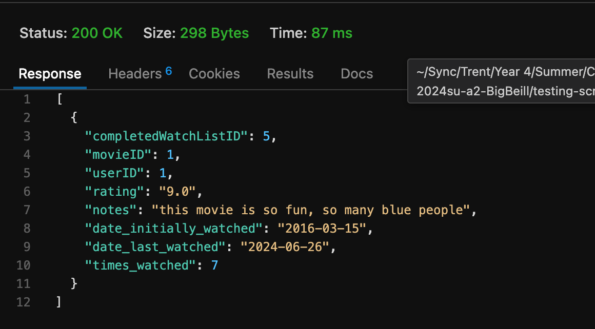

# Testing
## Create Account
this is what the database looks like before testing the create account function

### missing data
the system will give errors if any field is missing an input


### Bad Data
system will give errors if any data is invalid/taken


### result
once user is crated database looks like this

## Login
give an error when user tries to log in with incorrect information


## Profile
user can use profile to view and request a new api key


## User Status
## API Requests
### API Key testing
for all API requests that require an API key, here is the validation and testing associated:
API key is passed as a header variable like X-API-KEY. If this variable is not present the request will return the following:

if the key is present but there is no user in the DB with that key then you will get this message

otherwise it will return the appropriate results


### Movies
#### get Movies
this should return a json string of all movies in the database. API key is not required
URL is like:
```
https://loki.trentu.ca/~connorpink/3430/assn/cois-3430-2024su-a2-BigBeill/api/movies
```
returns like :

if no movies in data base:


##### filter movie title
example url https://loki.trentu.ca/~connorpink/3430/assn/cois-3430-2024su-a2-BigBeill/api/movies?name=pirate
name=pirate
output:

if no movies with title


##### filter movie rating
this should return json string of movies whos rating is above or equal to a certain number passed in the URL
example:
```https
https://loki.trentu.ca/~connorpink/3430/assn/cois-3430-2024su-a2-BigBeill/api/movies?rating=8
```
rating = 8
output:

if no movies with that rating or greater:


##### filter movie title and rating
here when a name and rating are passed it returns results with ratings = or greater than the number and a title like the name passed.
example URL 
```http
https://loki.trentu.ca/~connorpink/3430/assn/cois-3430-2024su-a2-BigBeill/api/movies?rating=7&name=dark
```
output:

if no movies with that title match and rating or greater


#### get movies with ID
returns movies with a particular ID that is in the URL. Accesses the MovieID from the DB.
URL like : 
```HTTPS
https://loki.trentu.ca/~connorpink/3430/assn/cois-3430-2024su-a2-BigBeill/api/movies/99/
```
output:

if no movie with ID exists

#### get movie rating by movie ID
returns the rating for a movie with a particular ID
url like: 
```Https
https://loki.trentu.ca/~connorpink/3430/assn/cois-3430-2024su-a2-BigBeill/api/movies/99/rating/
```
returns:

### To Watch List
#### Get all watch list entries
get all watch list entries with a URL like:
```http
https://loki.trentu.ca/~connorpink/3430/assn/cois-3430-2024su-a2-BigBeill/api/towatchlist/entries
```
output:

##### filter watch list by priority
returns watch list entries with a filter on priority
example url: 
```http
https://loki.trentu.ca/~connorpink/3430/assn/cois-3430-2024su-a2-BigBeill/api/towatchlist/entries?priority=2
```
output:

if no entries given for priority error 500:

if priority is not a number an error is returned

#### Post new watch list entry
Insert new entry in the toWatchListEntries table. requires API key. takes a body with form encoded data {movieID, priority, notes}. There is error checking to make sure the movieID is a number, the priority is a number, and that notes is a string.
example input body {movieID=99,priority=2,notes="watch this now"}
example URL
```http
https://loki.trentu.ca/~connorpink/3430/assn/cois-3430-2024su-a2-BigBeill/api/towatchlist/entries/
```
output:

if movieID, notes, or priority is not included an error is returned:

if movieID is not a number:

if priority is not a number:

if notes is not a string:

#### Put watch new list entry with ID
requires API key
creates a new watch list entry with a given movieID that is passed in the URL
takes a body with form encoded data () priority, notes}. There is error checking to make sure the , the priority is a number, and that notes is a string.
if the entry at that movieID already exists it is overwritten, if it does not exist then a new one is inserted
example input body {priority=2,notes="watch this now"}
example URL
```http
https://loki.trentu.ca/~connorpink/3430/assn/cois-3430-2024su-a2-BigBeill/api/towatchlist/entries/1
```
output if entry did not exist:

output if entry did exist and was overwritten:

### Completed Watch List
#### completed watch list entries
return all entries for user in completed watch list. User ID is retrieved based on the API key that is passed
URL like:
```HTTP
https://loki.trentu.ca/~connorpink/3430/assn/cois-3430-2024su-a2-BigBeill/api/completedwatchlist/entries
```
output:

if there are no entries for the user :

##### optional filter on number of times watched
filter the completed watch list results on number of times watched where times watched is equal to or greater than the times_watched variable passed. 
url like 
```HTTP
https://loki.trentu.ca/~connorpink/3430/assn/cois-3430-2024su-a2-BigBeill/api/completedwatchlist/entries?times_watched=2
```
output: 

error if times watched is not a number:

#### completed watch list rating by movieID
returns movieID and rating for completed wathchlist entry with the movieID passed in the URL
URL like: 
```http
https://loki.trentu.ca/~connorpink/3430/assn/cois-3430-2024su-a2-BigBeill/api/completedwatchlist/entries/1/rating
```

error if no entries:

### Users
#### See User Stats
URL like 
```http
https://loki.trentu.ca/~connorpink/3430/assn/cois-3430-2024su-a2-BigBeill/api/users/1/stats
``` 
returns:
1. date of first movies watched
2. first movies watched title
3. average movie rating
4. planned movie watch time
5. actual movie time watched
example:

if not enough information returns error:

if accessing the user info of a user ID that does not match your API key's associated user ID then returns an error like this:

### Incorrect Endpoint

