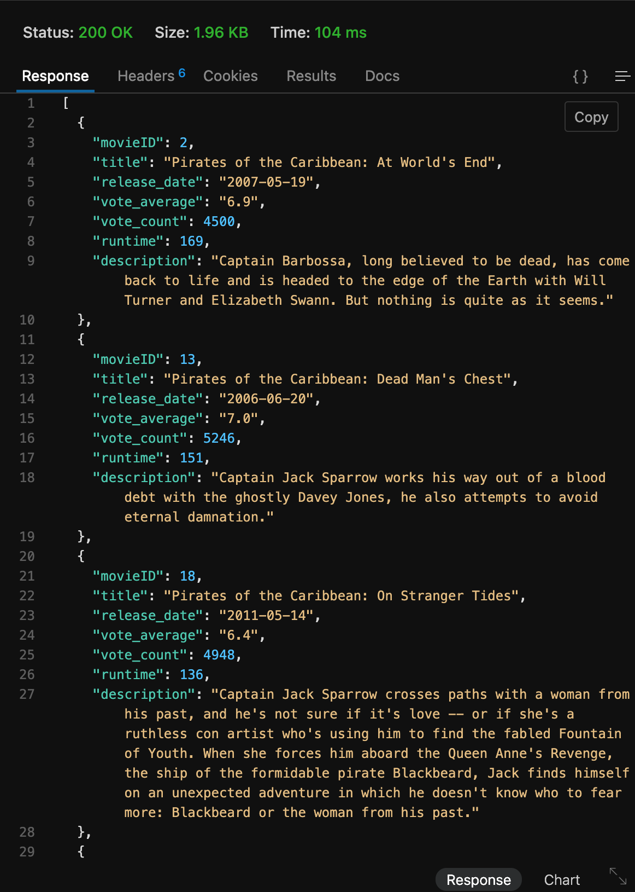

# Testing
## Create Account
this is what the database looks like before testing the create account function

### missing data
the system will give errors if any field is missing an input


### Bad Data
system will give errors if any data is invalid/taken


### result
once user is crated database looks like this

## Login
give an error when user tries to log in with incorrect information


## Profile
user can use profile to view and request a new api key


## User Status
## API Requests
### API Key testing
for all API requests that require an API key, here is the validation and testing associated:
API key is passed as a header variable like X-API-KEY. If this variable is not present the request will return the following:

if the key is present but there is no user in the DB with that key then you will get this message

otherwise it will return the appropriate results


### Movies
#### get Movies
this should return a json string of all movies in the database. API key is not required
URL is like:
```
https://loki.trentu.ca/~connorpink/3430/assn/cois-3430-2024su-a2-BigBeill/api/movies
```
returns like :


##### filter movie title
example url https://loki.trentu.ca/~connorpink/3430/assn/cois-3430-2024su-a2-BigBeill/api/movies?name=pirate
name=pirate
output:

##### filter movie rating
this should return json string of movies whos rating is above or equal to a certain number passed in the URL
example:
https://loki.trentu.ca/~connorpink/3430/assn/cois-3430-2024su-a2-BigBeill/api/movies?rating=8
rating = 8
output:


#### get movies with ID
### To Watch List
### Completed Watch List
### Users
### Incorrect Endpoint

