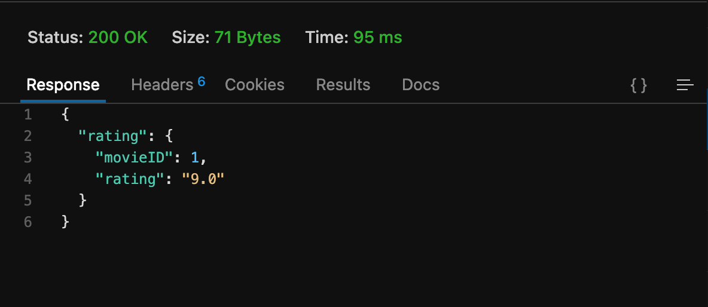
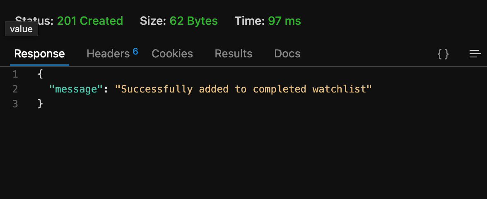
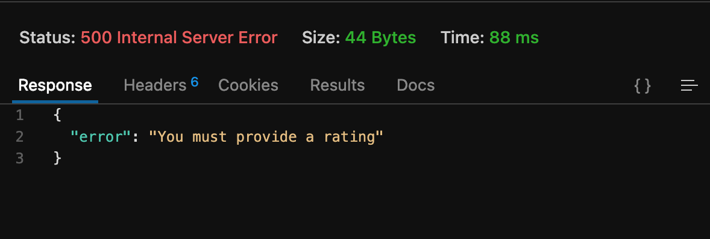
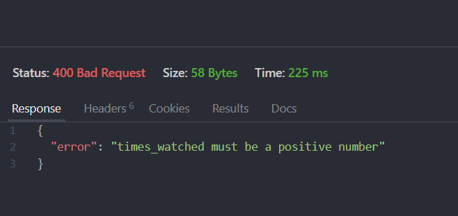

# Testing
## Create Account
this is what the database looks like before testing the create account function

### missing data
the system will give errors if any field is missing an input


### Bad Data
system will give errors if any data is invalid/taken


### result
once user is crated database looks like this

## Login
give an error when user tries to log in with incorrect information


## Profile
user can use profile to view and request a new api key


## User Status
## API Requests
### API Key testing
for all API requests that require an API key, here is the validation and testing associated:
API key is passed as a header variable like X-API-KEY. If this variable is not present the request will return the following:

if the key is present but there is no user in the DB with that key then you will get this message

otherwise it will return the appropriate results


### Movies
#### get Movies
this should return a json string of all movies in the database. API key is not required
URL is like:
```
https://loki.trentu.ca/~connorpink/3430/assn/cois-3430-2024su-a2-BigBeill/api/movies
```
returns like :

if no movies in data base:


##### filter movie title
example url https://loki.trentu.ca/~connorpink/3430/assn/cois-3430-2024su-a2-BigBeill/api/movies?name=pirate
name=pirate
output:

if no movies with title


##### filter movie rating
this should return json string of movies whos rating is above or equal to a certain number passed in the URL
example:
```https
https://loki.trentu.ca/~connorpink/3430/assn/cois-3430-2024su-a2-BigBeill/api/movies?rating=8
```
rating = 8
output:

if no movies with that rating or greater:


##### filter movie title and rating
here when a name and rating are passed it returns results with ratings = or greater than the number and a title like the name passed.
example URL 
```http
https://loki.trentu.ca/~connorpink/3430/assn/cois-3430-2024su-a2-BigBeill/api/movies?rating=7&name=dark
```
output:

if no movies with that title match and rating or greater


#### get movies with ID
returns movies with a particular ID that is in the URL. Accesses the MovieID from the DB.
URL like : 
```HTTPS
https://loki.trentu.ca/~connorpink/3430/assn/cois-3430-2024su-a2-BigBeill/api/movies/99/
```
output:

if no movie with ID exists

#### get movie rating by movie ID
returns the rating for a movie with a particular ID
url like: 
```Https
https://loki.trentu.ca/~connorpink/3430/assn/cois-3430-2024su-a2-BigBeill/api/movies/99/rating/
```
returns:

### To Watch List
#### Get all watch list entries
get all watch list entries with a URL like:
```http
https://loki.trentu.ca/~connorpink/3430/assn/cois-3430-2024su-a2-BigBeill/api/towatchlist/entries
```
output:

##### filter watch list by priority
returns watch list entries with a filter on priority
example url: 
```http
https://loki.trentu.ca/~connorpink/3430/assn/cois-3430-2024su-a2-BigBeill/api/towatchlist/entries?priority=2
```
output:

if no entries given for priority error 500:

if priority is not a number an error is returned

#### Post new watch list entry
Insert new entry in the toWatchListEntries table. requires API key. takes a body with form encoded data {movieID, priority, notes}. There is error checking to make sure the movieID is a number, the priority is a number, and that notes is a string.
example input body {movieID=99,priority=2,notes="watch this now"}
example URL
```http
https://loki.trentu.ca/~connorpink/3430/assn/cois-3430-2024su-a2-BigBeill/api/towatchlist/entries/
```
output:

if movieID, notes, or priority is not included an error is returned:

if movieID is not a number:

if priority is not a number:

if notes is not a string:

#### Put watch new list entry with ID
requires API key
creates a new watch list entry with a given movieID that is passed in the URL
takes a body with form encoded data () priority, notes}. There is error checking to make sure the , the priority is a number, and that notes is a string.
if the entry at that movieID already exists it is overwritten, if it does not exist then a new one is inserted
example input body {priority=2,notes="watch this now"}
example URL
```http
https://loki.trentu.ca/~connorpink/3430/assn/cois-3430-2024su-a2-BigBeill/api/towatchlist/entries/1
```
output if entry did not exist:

output if entry did exist and was overwritten:

if the body form data is not included an error is sent:

error if priority is not a number


#### Patch priority for to watch list entry
requires API key. takes form encoded body {priority} as an integer.
URL like : 
```http
https://loki.trentu.ca/~connorpink/3430/assn/cois-3430-2024su-a2-BigBeill/api/towatchlist/entries/5/priority
```
output:

if no priority is submit

if priority is not a number

if entry does not exist in watch list


#### Delete watch list entry with ID
requires API key. takes form encoded body like {movieID}. 
URL like:
```http
https://loki.trentu.ca/~connorpink/3430/assn/cois-3430-2024su-a2-BigBeill/api/towatchlist/entries/3/
```
output:

if movieID does not exist in toWatchList:

if movieID is not a number


### Completed Watch List
#### Get completed watch list entries
return all entries for user in completed watch list. User ID is retrieved based on the API key that is passed
URL like:
```HTTP
https://loki.trentu.ca/~connorpink/3430/assn/cois-3430-2024su-a2-BigBeill/api/completedwatchlist/entries
```
output:

if there are no entries for the user :

##### optional filter on number of times watched
filter the completed watch list results on number of times watched where times watched is equal to or greater than the times_watched variable passed. 
url like 
```HTTP
https://loki.trentu.ca/~connorpink/3430/assn/cois-3430-2024su-a2-BigBeill/api/completedwatchlist/entries?times_watched=2
```
output: 

error if times watched is not a number:

#### Get completed watch list rating by movieID
returns movieID and rating for completed wathchlist entry with the movieID passed in the URL
URL like: 
```http
https://loki.trentu.ca/~connorpink/3430/assn/cois-3430-2024su-a2-BigBeill/api/completedwatchlist/entries/1/rating
```

error if no entries:


#### Post completed watch list entry
inserts new entry in completed watch list table
requires API key.
This request also updates the rating of the movie in the movies table accounting for the number of times the person watched it for weighted effect.
URL like :
takes form-encoded body data:
{
    movieID,rating,notes,date_initially_watched,date_last_watched,times_watched
}
date values are formatted like YYYY-MM-DD
example URL is 
```http
https://loki.trentu.ca/~connorpink/3430/assn/cois-3430-2024su-a2-BigBeill/api/completedwatchlist/entries
```
output:

if movieID does not exist in movies table

if movieID already exists in completed watch list table

 times watched must be a integer

movieID must be a integer

rating must be a integer


rating must be between 1 and 10

date initially watched must be a date string

date last watched must be a date string


#### Patch completed watch list rating
updates the rating for given movieID for user in completed watch list table. takes MovieID in URL and times-watched as form-encoded body. 
This request also updates the rating for the movie in the Movie table accounting for the number of times the person watched it for weighted average.

requires API key.
URL like :
```http
https://loki.trentu.ca/~connorpink/3430/assn/cois-3430-2024su-a2-BigBeill/api/completedwatchlist/entries/1/rating
```
output:

if no rating provided

if rating is not an integer

rating must be a positive integer between 1 and 10


#### Patch adding times watched to completed watch list entry
adds number of times a movie is watched by the user with movieId passed in the URL
API key is required
URL like:
```
https://loki.trentu.ca/~mackenzieneill/3430/assn/cois-3430-2024su-a2-BigBeill/api/completedwatchlist/entries/1/times-watched
```
returns:

error if invalid id:

if no times watched provided

if times watched is not an integer

times watched must be a positive integer

#### Delete deleting item from completed Watch List
deletes item from Completed Watch List table with movieId passed in the URL
API key is required
URL like:
```http
https://loki.trentu.ca/~mackenzieneill/3430/assn/cois-3430-2024su-a2-BigBeill/api/completedwatchlist/entries/1
```
returns:

if incorrect id:

### Users
#### See User Stats
URL like 
```http
https://loki.trentu.ca/~connorpink/3430/assn/cois-3430-2024su-a2-BigBeill/api/users/1/stats
``` 
returns:
1. date of first movies watched
2. first movies watched title
3. average movie rating
4. planned movie watch time
5. actual movie time watched
example:

if not enough information returns error:

if accessing the user info of a user ID that does not match your API key's associated user ID then returns an error like this:

### Incorrect Endpoint

